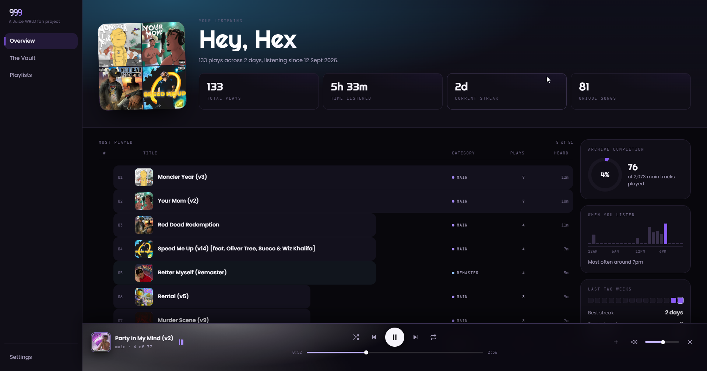
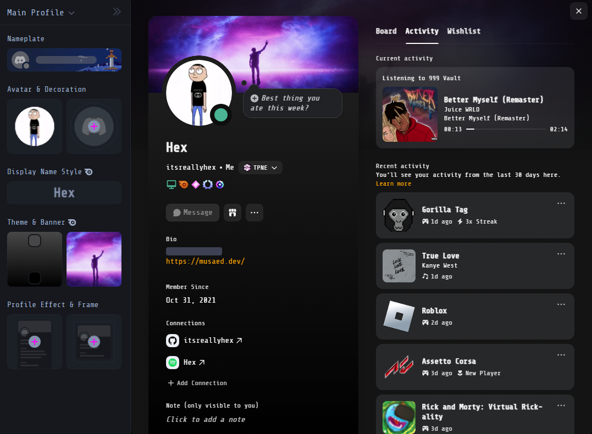

# 999, desktop

A Tauri 2 app over the same archive the site reads. A listening overview,
the Vault, the playlists, a player that keeps going between them, and
Discord Rich Presence.



## Run it

```bash
cd desktop
npm install
npx tauri build
```

That makes `src-tauri/target/release/vault999.exe` and two installers under
`src-tauri/target/release/bundle/` (NSIS and MSI, both `999 Vault_0.1.0`).
Run any of them. `npm run dev` is only for working on the Rust side.

Needs Rust plus, on Windows, two Visual Studio components: *MSVC v143 - VS
2022 C++ x64/x86 build tools* and a *Windows 11 SDK*. Run cargo from
PowerShell, not Git Bash: Git's own `link.exe` shadows the MSVC linker.

**Editing the pages needs no rebuild.** They are read off disk at runtime.
Point `pages_dir` in the config file at `desktop/src`, then:

- **Ctrl+R** or **F5** reloads the page. The music keeps playing.
- **Ctrl+Shift+R** reloads the whole window, player included. Needed after
  editing `player.js` or `shell.js`.

Only changes under `src-tauri/` need a rebuild.

## Point it at the archive

**With nothing on the machine, it works anyway.** The installer carries the
catalogue (the whole app is under 3 MB), so on first run the app writes it
to its own data folder and opens with all 3,879 records. Covers come from
the archive's CDN and songs stream from it. Install, open, listen.

With the archive on disk it reads that instead: the same `web/data` folder
the site uses, covers and audio included. A dev build inside the checkout
finds it on its own. Anything else is told where to look, first hit
winning:

1. `NINE_DATA_ROOT` in the environment.
2. `data_root` in the config file.
3. A `data` folder beside the exe.
4. A `data` folder in the OS app data directory.
5. `web/data` in a checkout above the exe.

The config file is `%APPDATA%\xyz.juicevault.nine\config.toml`, written as a
commented template on first run. Use forward slashes and single quotes:

```toml
data_root = 'D:/Random coding/juiceapi/web/data'
pages_dir = 'D:/Random coding/juiceapi/desktop/src'
discord_client_id = "..."
```

The app prints what it resolved, and which rule answered, on startup.

## What it does

**The overview** is the opening page: a greeting, total plays, time
listened, streak, unique songs, the eight most played tracks (click one to
play it), how much of the 2,073 main tracks you have played, plays by hour,
and the last two weeks. All of it comes from a listening history the player
writes as you go. It starts empty.

**The Vault and the playlists** are the site's, with two additions. The
playing track is marked on its row and card, and a track you never pulled to
disk streams from the archive instead of refusing; the bar says `via API`
while it does. Next prefers files on disk and streams only when the current
filter has none. One click on a Vault card opens the detail panel, two play
it.

**The player** lives outside the pages, so switching tabs does not stop the
music.

**Discord** shows what is playing while the app is open and Discord is
running. Three states:

Playing: title, "Juice WRLD", cover, progress bar.



Repeat-one on: the second line says "On repeat".

.png)

Paused: "Paused" and a timer counting up from the pause.

.png)

Stopping, or a track ending, clears it. The cover comes from the archive's
CDN because Discord fetches it from its own servers. The client id goes in
`config.toml` as `discord_client_id`.

## Files

```text
src/
  shell.html      The window. Holds the player; shows the pages in a frame.
  index.html      The overview.
  vault.html
  playlists.html
  js/tauri.js     The only module that talks to Rust.
  js/player.js    The only module that owns an audio element.
src-tauri/src/
  paths.rs        Every path, resolved at runtime.
  data.rs         The archive folder and its JSON indexes.
  pages.rs        Serves src/ off disk.
  presence.rs     Discord.
  tools.rs        Runs the Python scripts in web/tools.
```

Nothing here imports from `web/`. Shared modules are copies and have
diverged.

## Not done

- The Vault, the now-playing mark and the double click are proved in jsdom
  only; not yet seen in the window.
- The catalogue a fresh install starts from is the one the installer was
  built with. Refreshing it still needs `sync.py`, which needs Python.
- The audio index loads once per launch. Run `save-audio.py` with the app
  closed, or restart it.
- `run_tool` can run the Python scripts but nothing in the interface calls
  it. Python has to be on PATH.
- An old `999_0.1.0_x64-setup.exe` still sits in `bundle/nsis/`. Delete it.
