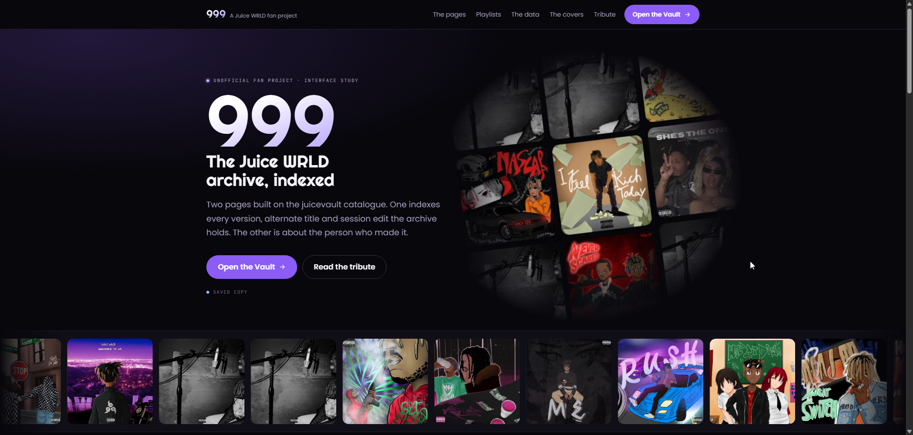
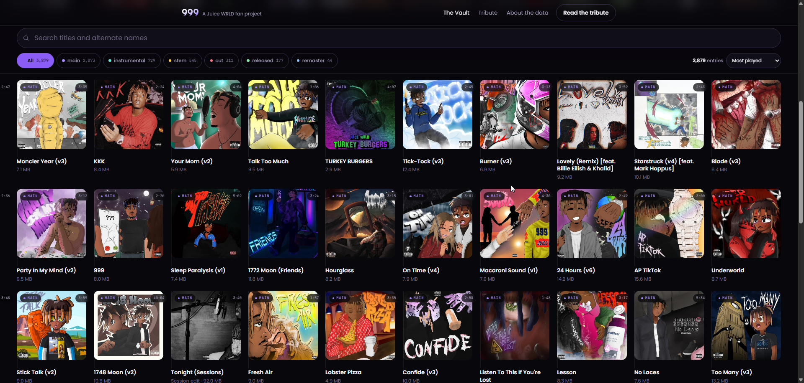
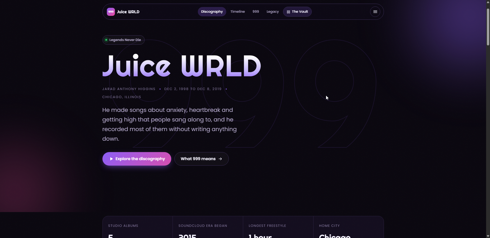

# 999

A personal project. A fan-made site about the Juice WRLD archive: a home page,
a searchable index of the archive called the Vault, playlists saved in the
browser, and a tribute page.

It shows the details of each track and the cover art, and plays the songs I
have pulled to disk.

**It is not hosted anywhere.** There is no live URL and there is not going to
be one. I built it for myself, I run it from a local server on my own machine,
and I am the only person who uses it. No deployment, no domain, no accounts, no
analytics. This readme is here so I remember how the thing works later, not to
introduce it to anybody.



## What is here

### The Vault

The main page. It lists every entry the archive holds, 3,879 of them, and lets
you dig through them.



What you can do with it:

- Search by title. It searches other names too, which matters, because 1,499
  entries go by more than one name.
- Filter by type: main, instrumental, stem, cut, released and remaster.
- Sort by plays, title, date added or length.
- Click any cover to see the full record: every other name it goes by, how long
  it runs, the file size and when the archive added it.
- Press `/` to jump straight to the search box.
- Play a track, if I have pulled the audio. Hovering a cover shows a play
  button, and the detail panel has one too.

Cards load 60 at a time as you scroll, because putting all 3,879 on the page at
once is too slow to use.

### Playlists

My own running orders over the archive. Every card in the Vault has an add
button, and `playlists.html` is where they get arranged: rename, reorder,
remove, and play the list from any row.

They live in the browser's own database, in one browser profile on this
machine. There is no account and no server holding them, which is exactly why
the page has an export and an import sitting in plain sight rather than buried
in a menu. Clearing site data takes them with it, so the export is the only
copy that survives that.

A saved row keeps its own copy of the track, not a pointer at the catalogue.
It costs a little space and means a playlist still reads correctly with the
archive unreachable.

### The player

A bar fixed to the bottom of the Vault and the playlists page. It stays there
while I move between the two, picking up whatever was playing.

Play, pause, previous, next, a seek bar I can drag with the elapsed and total
time either side, volume, shuffle and repeat. Volume is remembered between
visits. The bar tints itself from the artwork of whatever is playing, using
the same palette the cover art is drawn from, so it is never a colour that
fights the picture.

The two pages behave differently on purpose, because they are different things:

- **In the Vault**, tracks are a pile, not an order. A track that finishes
  stops. **Next** picks at random, and it stays inside whatever I have
  filtered to: if I am looking at instrumentals, Next gives me an
  instrumental. It also avoids the last 200 things it played, so a long
  session does not keep circling the same handful. That list of 200 is kept
  in the browser database and survives a reload. **Previous** walks back
  through what I actually played, which is the only thing that makes sense
  when forward is random.
- **In a playlist**, tracks are an order. They play top to bottom and advance
  on their own. **Shuffle** deals a random order once and then follows it, so
  it works through the whole list without repeating a track or skipping one.

Repeat cycles through off, all and one.

It only plays what is actually on my disk. 2,662 of the 3,879 records have
audio saved, because I skipped instrumentals, cuts and released tracks. The
rest still show a play button, and pressing it says the file is not saved
rather than failing quietly. Nothing here streams from the archive.

### The tribute

A page about Jarad Higgins, 1998 to 2019. His five studio albums, a short
timeline of what happened, what 999 meant to him, and where to get help if you
need it.



## Things worth knowing

**The site works online or fully offline. That part is up to me.**

Either way the pages behave the same. The difference is only how much of the
archive is sitting on my own disk:

| | what it needs | disk |
| --- | --- | --- |
| Online | nothing saved, asks the API each load | 0 |
| Catalogue saved | one command | 1.67 MB |
| Catalogue and covers | one command | 104 MB |
| Plus the audio | see [tools/README.md](tools/README.md) | 26 GB |

The listing and the artwork are the easy part. `tools/save-catalogue.py` fetches
both, and needs no account, no key and no setup. Two minutes and the site never
has to touch the network again.

Audio is the involved one, because it is 26 GB and needs a login. That has its
own guide: **[tools/README.md](tools/README.md)**, step by step. It is also the
one that changes what the site can do rather than just where it reads from:
without it the pages are a catalogue, and with it the player works.

**The API is a fallback now, not the source.**

The site used to ask `api.juicevault.xyz` for the catalogue on every single
load, which meant somebody else's server being slow, down, or gone one day
decided whether my own pages worked. That is a silly thing to accept on a
project that runs entirely on my own machine, so the data lives here instead:

```text
data/catalogue.json    1.67 MB    all 3,879 records
data/covers/            102 MB    1,877 cover images
```

A normal page load now makes **one request, to my own machine**, and nothing
leaves it. Pull the network cable out and the Vault still opens with all 3,879
entries and all their artwork.

### How it decides where to read from

`js/api.js` tries three sources in order and takes the first that works. This
is automatic, every load, with nothing to configure:

1. **The saved copy**, `data/catalogue.json`. Almost always this one.
2. **The live API**, if the saved copy is missing or unreadable. So a fresh
   checkout with no `data/` folder still works, it just goes to the network to
   do it.
3. **The bundled sample**, 39 entries hardcoded in `js/seed.js`, if the archive
   fails too. Enough to see that the page itself is fine and it is the data
   that is not.

The switch is silent and needs no input from me, but it is not hidden: the
indicator at the top of the page always says which one it used.

- **Saved copy**, in blue, with the date the snapshot was taken.
- **Live**, in green, so there is no saved copy and it went to the archive.
- **Offline sample**, in amber, so both failed.

If that reads "Live" when I expected "Saved copy", the snapshot is missing and
I should run the script below. It fails soft rather than breaking, which is
why the indicator exists at all.

The saved copy gets a 4 second timeout against the network's 12. A local file
that stalls should hand over to the API quickly rather than making me stare at
loading skeletons for twelve seconds first.

### Refreshing it

```bash
python tools/save-catalogue.py                    # catalogue only, 1.67 MB
python tools/save-catalogue.py --covers           # catalogue and any new covers
python tools/save-catalogue.py --dedupe           # tidy covers on disk, no network
python tools/save-catalogue.py --covers --force   # re-download covers I already have
```

Nothing expires and nothing updates itself. Running a script is the entire
update mechanism, which is the point: the data changes when I decide it
changes, not when someone else edits their database.

### Getting just what is new

`save-catalogue.py` replaces the whole snapshot. Most of the time I only want
the difference, and that is what `sync.py` is for:

```bash
python tools/sync.py --check    # what has the archive added? change nothing
python tools/sync.py            # show me, ask, then fetch it
```

It compares the saved copy against the live listing and tells me what is new,
what has been removed, and what has been retitled upstream. If I say yes it
downloads the audio for the new main, stem and remaster records, picks up any
new covers, and rewrites the catalogue. Then I reload the browser.

Two things it gets right that are easy to get wrong:

- **It usually needs no login.** The token faff in
  [tools/README.md](tools/README.md) is because the first pull was 2,662 files.
  A few new songs fit inside the anonymous allowance of 500 a day.
- **The category filter is on the audio, not the catalogue.** Every new record
  goes into `catalogue.json` whatever it is, so the Vault keeps listing
  everything. Only main, stem and remaster get downloaded.

It also fixes the drift. A title corrected upstream stays wrong in my copy
until something re-reads the listing, and this is the thing that re-reads it
without re-fetching 26 GB.

**Covers are real where the archive has them.** 2,073 entries come with their
own art, and anything without real art gets a cover drawn from its title
instead: 8 layouts and 16 colour sets, and the same title always gets the same
one. That generated cover also sits underneath every real image, so a cover
that fails to load does not leave a hole, it just reveals the drawn one.

**Identical covers are stored once.** The archive gives every record its own
cover id even when the image is byte-identical, so the first pass put the same
instrumental placeholder on disk 723 times: 3,879 files holding 1,877 distinct
images, 238 MB where 102 MB would do.

Files are now named after the sha1 of their own bytes, and
`data/covers-index.json` maps each record to its hash. Identical images
collapse to one file and every record that uses it points at the same path.
723 records share a single file now. That also makes a re-run cheap: anything
already in the index is skipped without a request, so only genuinely new
covers get fetched.

```bash
python tools/save-catalogue.py --dedupe     # tidy what is already on disk
```

That one makes no network request at all. It hashes the files I already have,
keeps one copy of each distinct image, and repoints the saved catalogue.

There is no way to spot a duplicate *before* downloading it, so a first run
still pulls all 3,879. The `?v=` hash in the cover URL is per record, so 723
identical images carry 723 different values, and the CDN's ETag encodes upload
time rather than content. Only the bytes tell the truth.

**This is a personal fan project.** It is not published, and it is not
connected to the estate of Jarad Higgins, Grade A Productions or Interscope
Records. Cover images belong to their owners and are here to show which track
is which.

## Run it

Locally is the only way it runs, on `127.0.0.1`, started by hand when I want
it. There is no hosted copy to visit instead.

You need a web server. Double-clicking `index.html` will not work: the browser
blocks JavaScript modules loaded straight off the disk, and you get a blank
page with no obvious reason why.

```bash
python serve.py
```

Then open <http://127.0.0.1:8777>.

`serve.py` is a small wrapper around Python's own `http.server` that fixes four
things it gets wrong here. The first two have always been needed. The last two
are what it takes to serve audio at all:

- **It sends `Cache-Control: no-store`.** The built in server sends no cache
  headers at all, so browsers hold on to JavaScript heuristically and I end up
  staring at a page I already fixed, debugging a file that is no longer on
  disk. This is the single most confusing failure mode in the project. Audio
  is the one exception, because I never edit a track mid-session and
  re-fetching one every time I drag the seek bar is pointless.
- **It forces the MIME types.** `http.server` reads them from the Windows
  registry, which on some machines answers `text/plain`. Browsers hard refuse
  ES modules served that way and the page goes blank with no useful error.
  The audio types are pinned for the same reason: a wrong one makes the
  browser refuse a file that is perfectly good.
- **It handles more than one request at a time.** The built in server does
  one. A playing track holds its connection open for the whole song, so on
  the old server one track would block every cover and every script behind
  it and the page would look frozen.
- **It answers range requests.** The built in server ignores them and sends
  the whole file, which means the browser cannot jump to a part of a song it
  has not already downloaded, and dragging the seek bar snaps back.

If a change to the server seems to do nothing, check nothing older is still
listening: on Windows a second copy can bind the same port and answer instead.

```bash
netstat -ano | grep :8777
```

Plain `python -m http.server 8777 --bind 127.0.0.1` works for a quick look, but
expect the cache to bite the moment I edit anything.

It binds loopback only, on purpose. Nothing here is meant to be reachable from
another machine.

There is nothing to install. No npm, no build step, no config file, no API key.

## How it is built

Plain HTML, CSS and JavaScript modules. No framework, no bundler, no
dependencies.

```text
index.html      home page
vault.html      the archive index
playlists.html  my playlists, saved in the browser
style.css       shared colours, fonts, nav, buttons and the cover art system
home.css        home page styles, layered on style.css
player.css      the player bar and its play buttons, layered on style.css
serve.py        the local server: no-cache, loopback, threaded, range requests
tribute/        the tribute page, with its own CSS and JS
data/
  catalogue.json    my saved copy of the archive, read before the network
  covers/           cover images, named by hash so identical art is stored
                    once. gitignored
  covers-index.json record id to cover hash. gitignored, rebuildable
  audio/            the songs, if I have pulled them. gitignored
  audio-index.json  record id to saved filename. gitignored, and the only
                    way the player knows which file is which, because the
                    names are cleaned up and the extensions vary.
                    rebuildable from the files on disk, no downloads
tools/
  README.md          how to download the audio, step by step
  save-catalogue.py  writes the catalogue and the covers
  save-audio.py      downloads the songs
  sync.py            fetches only what the archive has added since last time
js/
  config.js     settings and constants
  utils.js      small helpers
  api.js        the only file that touches the network, saved copy first
  covers.js     the generated cover art
  db.js         the only file that touches IndexedDB, for playlists
  ui.js         drawing the page
  lightbox.js   the detail panel
  picker.js     the add-to-playlist dialog
  player.js     the only file that owns an audio element, for playback
  app.js        Vault startup
  home.js       home page startup
  playlists.js  playlists startup
  seed.js       the 39-entry offline sample
```

The data originally comes from `https://api.juicevault.xyz`, which sends an
open CORS header, so the browser can read it directly with no server of my own
in between. That is still where `tools/save-catalogue.py` gets it from. The
pages themselves no longer go there: they read `data/catalogue.json` and only
fall back to that URL if the saved copy has gone missing.
